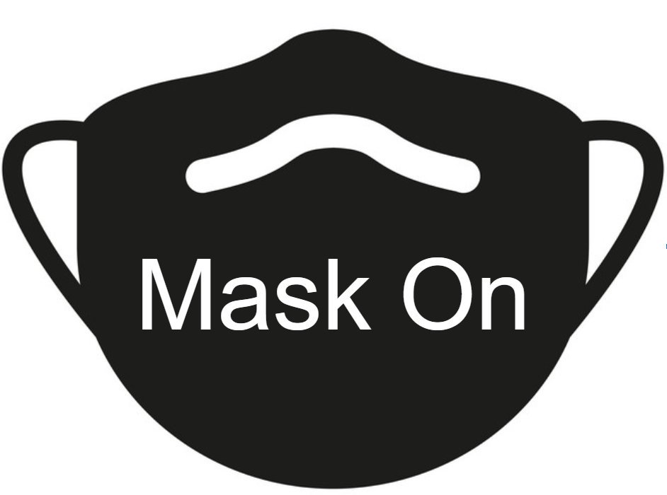

> `maskon` is a native application that will notify users to don their mask when they enter the great indoors.

## MaskOn

**Table of contents**

- [The Issue](#the-issue)
- [Our Solution](#our-solution)
- [Project Team](#project-team)

## The Issue

The COVID-19 pandemic has changed the way our society interacts. Social distancing and mask-wearing are critical tools in the fight against COVID-19. Mask-wearing is especially critical in areas with poor ventilation (i.e. the indoors). While mask-wearing has quickly become a part of our lives, for many it is not yet a habitual practice. Our goal is to help people develop good mask-wearing habits.

## Our Solution

Our app detects when a user's phone is indoors vs outdoors. The user will get a push notification when they are detected as having moved indoors from the outside, reminding them to put on a mask. User GPS data is not tracked, all user data is anonymized, and battery life should not be heavily impacted by this service.

## Project Team

- @sylvanosullivan
- @IMax153
- @lprzychodzien